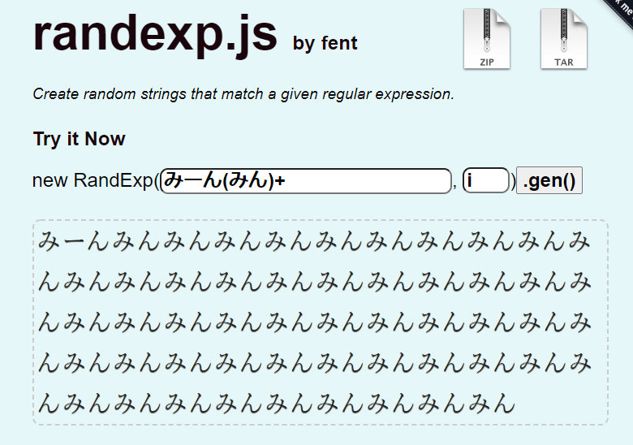

   
It is used by [randexp.js](https://github.com/fent/randexp.js)

#  Regex-Semi

セミの鳴き声を正規表現で記述するリポジトリです。  
The repository of regular expressions describing cicada sounds.  
It is written in Japanese. 

  

## 📖蝉の一覧
* [ミンミンゼミ](ミンミンゼミ.txt)
* [ツクツクボーシ](ツクツクボーシ.txt)
* [ひぐらし](ひぐらし.txt)

## 🎫LICENSE

[MIT](./LICENSE)

## ✍Author

[PenguinCabinet](https://github.com/PenguinCabinet)
